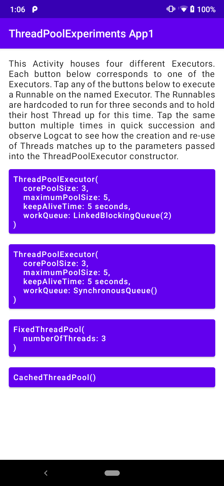

# An analysis of the parameters available in the ThreadPoolExecutor constructor

This module is a simple, single-screen Android application that demonstrates what each of the `corePoolSize`
, `maximumPoolSize`, `keepAliveTime` and `workQueue` parameters mean in
the [ThreadPoolExecutor](https://developer.android.com/reference/java/util/concurrent/ThreadPoolExecutor)
constructor.

When you run the app, you will see an interface as below. The text in the interface describes the purposes of
app and the function of each of the buttons.

