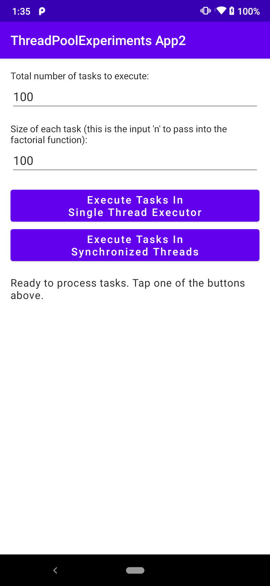

# An analysis of using the ThreadPoolExecutor class as a means of achieving a sequential queue

This module is a simple, single-screen Android application that compares
the [ThreadPoolExecutor](https://developer.android.com/reference/java/util/concurrent/ThreadPoolExecutor)
class and the [synchronized](https://docs.oracle.com/javase/tutorial/essential/concurrency/syncmeth.html)
keyword as a means of achieving a sequential queue.

When you run the app, you will see an interface as below. The text in the interface describes the purpose of
the app and the function of each of the buttons.

