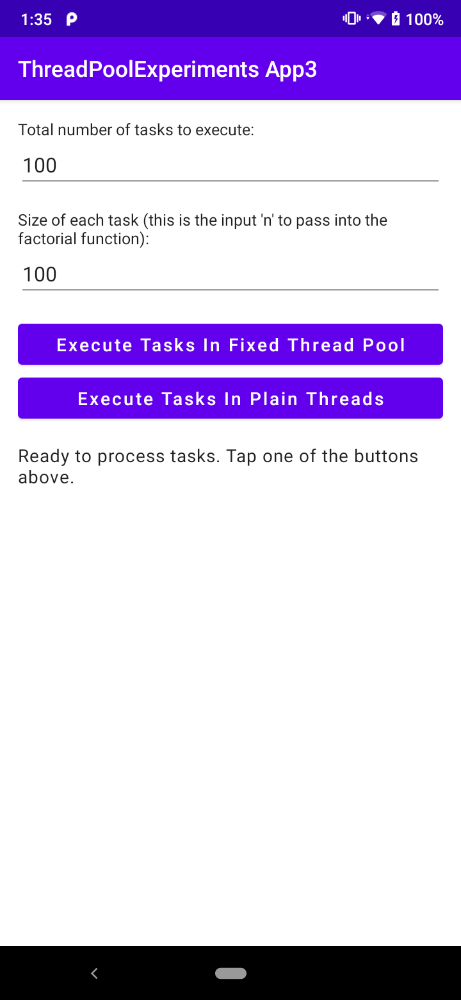

# A comparison of using a fixed thread pool for executing tasks concurrently as opposed to an unbounded thread pool

This module is a simple, single-screen Android application that compares
a [Fixed Thread Pool](https://developer.android.com/reference/java/util/concurrent/Executors#newFixedThreadPool(int))
for executing tasks concurrently as opposed to an unbounded thread pool.

When you run the app, you will see an interface as in the screenshot below. The text in the interface
describes the purpose of the app and the function of each of the buttons. The two tables below the screenshot
show the difference in execution time when the factorial function is run multiple times in
a [Fixed Thread Pool](https://developer.android.com/reference/java/util/concurrent/Executors#newFixedThreadPool(int))
as opposed to spawning a separate thread for each execution.

## Executing the factorial function repeatedly in a Fixed Thread Pool

The table below shows the total execution time when the factorial function is run repeatedly in
a [Fixed Thread Pool](https://developer.android.com/reference/java/util/concurrent/Executors#newFixedThreadPool(int))
which has a size equal to the number of processors available to the Java virtual machine.

<table>
    <tr>
        <th></th>
        <th>factorial(100)</th>
        <th>factorial(1,000)</th>
        <th>factorial(10,000)</th>
    </tr>
    <tr>
        <th>1 execution</th>
        <td>&lt; 10 milliseconds</td>
        <td>&lt; 20 milliseconds</td>
        <td>&lt; 300 milliseconds</td>
    </tr>
    <tr>
        <th>10 executions</th>
        <td>&lt; 10 milliseconds</td>
        <td>&lt; 50 milliseconds</td>
        <td>&lt; 1,000 milliseconds</td>
    </tr>
    <tr>
        <th>100 executions</th>
        <td>&lt; 50 milliseconds</td>
        <td>&lt; 300 milliseconds</td>
        <td>App crashes</td>
    </tr>
</table>

## Spawning a new thread for each execution of the factorial function

The table below shows the total execution time when a new thread is spawned for each execution of the
factorial function. The threads are not `synchronized` so they are all alive in memory and running
concurrently.

<table>
    <tr>
        <th></th>
        <th>factorial(100)</th>
        <th>factorial(1,000)</th>
        <th>factorial(10,000)</th>
    </tr>
    <tr>
        <th>1 execution</th>
        <td>&lt; 10 milliseconds</td>
        <td>&lt; 20 milliseconds</td>
        <td>&lt; 300 milliseconds</td>
    </tr>
    <tr>
        <th>10 executions</th>
        <td>&lt; 20 milliseconds</td>
        <td>&lt; 50 milliseconds</td>
        <td>&lt; 1,000 milliseconds</td>
    </tr>
    <tr>
        <th>100 executions</th>
        <td>&lt; 100 milliseconds</td>
        <td>&lt; 600 milliseconds</td>
        <td>App crashes</td>
    </tr>
</table>

## Conclusion

My takeaway from this app is that the difference between using
a [Fixed Thread Pool](https://developer.android.com/reference/java/util/concurrent/Executors#newFixedThreadPool(int))
and an unbounded thread pool for concurrent task execution in an Android application is quite inconsequential
in terms of execution time. The total execution time is almost identical in the the unbounded thread pool as
it is in
the [Fixed Thread Pool](https://developer.android.com/reference/java/util/concurrent/Executors#newFixedThreadPool(int))
regardless of the size of the task and regardless of the number of tasks running concurrently.
